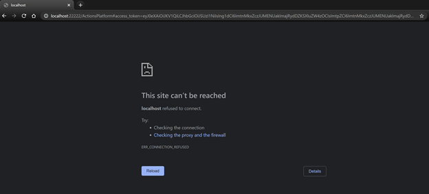

# Action Package deployment PowerShell script

# Prerequisites

To begin, you will need:
* A Microsoft 365 subscription
* A team with the users who will be sending Polls using this app. (You can add and remove team members later!)  
* A copy of the Poll app GitHub repo (ToDo: Add path here)  


# Step 1: Create your Poll app

To create the Teams Poll app package:
1. Make sure you have cloned the app repository locally. Navigate to PreCompiledApp folder.
1. Open the actionManifest.json file in a text editor.
1. Change the placeholder fields in the manifest to values appropriate for your organization. 
    * packageID - A unique identifier for this app in reverse domain notation. E.g: com.contoso.pollapp. (Max length: 64) 
    * developer.[]()name ([What's this?](https://docs.microsoft.com/en-us/microsoftteams/platform/resources/schema/manifest-schema#developer))
    * developer.websiteUrl
    * developer.privacyUrl
    * developer.termsOfUseUrl
1. Copy all content of PreCompiledApp folder and send it to zip. Name this zip as "ActionPackage.zip". 


Note: Make sure you do not change to file structure of the PreCompiledApp folder, with no new nested folders.  
<br/>

# Step 2: Deploy app to your organisation

1. Open a PowerShell console on your machine.
1. Find PowerShell module named "ActionPackageScripts.psm1" present in this repo. Copy its absolute path to use in following command. 

    **```import-module "<AbsolutePathFor_ActionPackageScripts.psm1>"```**

    This command imports the Functions exported by ActionPackageScripts.psm1 module, so that you can use them from your PowerShell console in next step.

1. Run the below command to deploy the app package to your Microsoft 365 subscription. When prompted, log in to your AAD account.  

    **```New-ActionPackage -PackageZipFilePath "<AbsolutePathFor_ActionPackage.zip_CreatedInStep1>" [-TeamsAppDownloadDirectoryPath <AbsolutePathForTeamsAppDownloadDirectory>] [-LogLevel <LogLevel>] [-LogDirectoryPath <AbsolutePathForLogDirectory>] [-Endpoint <Endpoint>] [-AccessToken <AccessToken>]```**
<br/>
    
    ### PackageZipFilePath (The only mandatory parameter)
    User needs to provide path to the compiled action package zip.

    ### TeamsAppDownloadDirectoryPath (optional parameter)
    Directory where the script downloads final Teams App manifest zip. If this parameter is not provided, app zip will be downloaded in working directory.

    ### LogLevel (optional parameter)
    This parameter can be used to set console logging level. By default the log level is set to `info`.
    - **error** - Just error logs will be shown
    - **warning** - Error and warning messages will be shown
    - **info** - Beside status messages, informative logs will be shown
    - **debug** - More debug logs will be shown
    - **none** - No logs will be shown

    ### LogDirectoryPath (optional parameter)
    Directory where the script stores the log file. If this parameter is not provided, logs will be stored in working directory.

    ### Endpoint (optional parameter)
    Set to "https://actions.office365.com" by default. 

    ### AccessToken (optional parameter)
    If this script fails to acquire the token due to MSAL PowerShell module installation or any other issues, then you can manually acquire the token and provide it as input to this script.

1. An AAD custom app, Bot are programmatically created in your tenant to power the Poll message extension app in Teams.
1. After successful execution of above command, a Poll Teams app zip file is generated at `<Home_Directory>\TeamsApp\TeamsManifest.zip`.

<br/>

# Step 3: Run the app in Microsoft Teams

If your tenant has sideloading apps enabled, you can install your app by following the instructions [here](https://docs.microsoft.com/en-us/microsoftteams/platform/concepts/apps/apps-upload#load-your-package-into-teams).

You can also upload it to your tenant's app catalog, so that it can be available for everyone in your tenant to install. See [here](https://docs.microsoft.com/en-us/microsoftteams/tenant-apps-catalog-teams).

Upload the generated Poll Teams app zip file (the `TeamsManifest.zip` generated in above step) to your channel, chat, or tenant’s app catalog. 

<br/>

# Step 4: Update your Poll Teams app

If you want to update the existing Poll Teams app with latest functionality -
1. Make sure you have cloned the latest app repository locally.
1. Open the `actionManifest.json` file in a text editor.
    * Change the placeholder fields (`packageID`, `developer.name`, `developer.websiteUrl`, `developer.privacyUrl`, `developer.termsOfUseUrl`) in the manifest with existing values in your Poll Teams app. 
    * Update the `version` field in the manifest. Make sure latest version number is higher than previous version number.  
1. Copy all content of PreCompiledApp folder and send it to zip. Name this zip as "ActionPackage.zip". 
1. Run the following commands to update your Poll Teams app with the latest bits of code. When prompted, log in using your AAD account. 
    
    **```import-module "<AbsolutePathFor_ActionPackageScripts.psm1>"```** <br/><br/>
    Then run following command: <br/>
    **```Update-ActionPackage -PackageZipFilePath "<AbsolutePathFor_ActionPackage.zip_CreatedInLastStep>" [-TeamsAppDownloadDirectoryPath <AbsolutePathForTeamsAppDownloadDirectory>] [-LogLevel <LogLevel>] [-LogDirectoryPath <AbsolutePathForLogDirectory>] [-Endpoint <Endpoint>] [-AccessToken <AccessToken>]```**
1. Your Poll app on Teams automatically gets updated to the latest version. 

<br/><br/>

# Troubleshooting

## Failure in MSAL.PS PowerShell module installation or AccessToken acquisition
Please follow below steps to acquire the AccessToken manually.<br/>
Open below link in browser and login to your AAD account when prompted.<br/>

https://login.microsoftonline.com/common/oauth2/v2.0/authorize?response_type=token&response_mode=fragment&prompt=select_account&client_id=cac88df7-3599-49cf-9465-867b9eee33cf&redirect_uri=http://localhost:22222/ActionsPlatform&scope=https://actions.office365.com/ActionPackage.ReadWrite.All <br/>

After successful login, browser address bar will contain string similar to below screenshot.

Url is in your browser address bar has following format: http://localhost:22222/ActionsPlatform#access_token=**<ACCESS_TOKEN>**&token_type=Bearer&expires_in=3598&scope=https%3a%2f%2factions.office365.com%2fActionPackage.ReadWrite.All&session_state=...

Copy the access_token value from this url. Set this token as AccessToken Parameter in 
**```New-ActionPackage```** or **```Update-ActionPackage```** command as explained above.